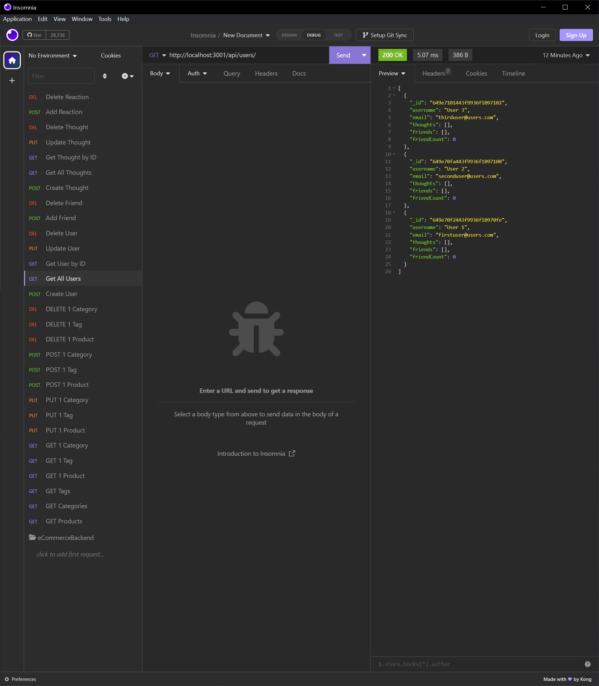

# SNSNoSQL

## BADGE
 

## [DESCRIPTION](#description)
This application is an API used for a social network where users can use basic social media network functions in a NoSQL environment.

## SCREENSHOT

## VIDEO WALKTHROUGH
https://drive.google.com/file/d/1IxSu5elLlqD3cnvHtrF7Q4z09hEuvrgT/view

## [INSTALLATION](#installation)
Run the terminal command "npm i" in the root directory, then use npm to install express.js and mongodb.

## [USAGE](#usage)
First, start up the Mongo DB by running a program like MongoDB Compass or by running the appropriate terminal command. Then make sure to run the command "npm run start" to run the server, then test the routes using a program like Insomnia at http://localhost:3001

## [LICENSE](#license)
MIT

## [CONTRIBUTING](#contributing)
Please contact the author at paul.koehler@gmail.com

## [TESTS](#tests)
Run through the various tests to test functionality by testing the creation, updating and deletion of users, friends, thoughts, and reactions.

## [QUESTIONS](#questions)
If you have any questions, please feel free to reach out to the author of this application at the following GitHub page and email address.

https://github.com/pk50sshowa

[paul.koehler@gmail.com](paul.koehler@gmail.com)